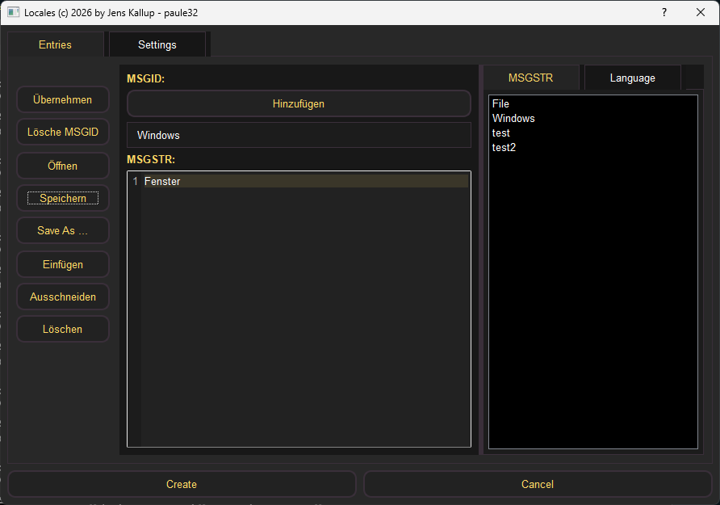
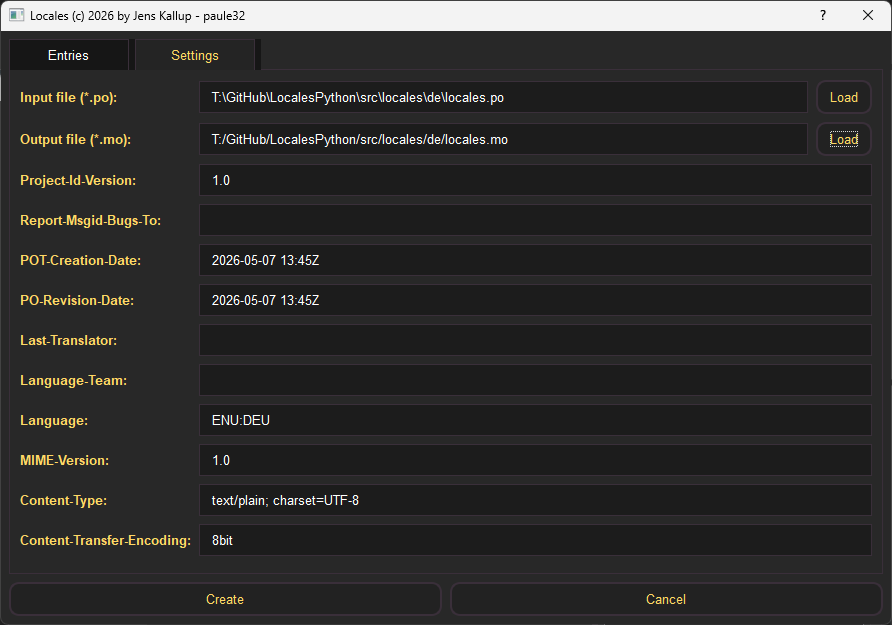
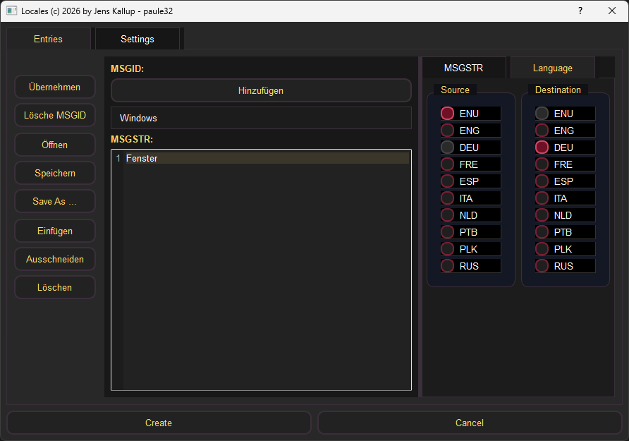

# LocalesPython
Python Application to create locales .po and .mo file for Language translater Support

In progress: [website](https://paule32.github.io/LocalesPython/)

Preview Locales A

Preview Locales B

Preview Locales C

